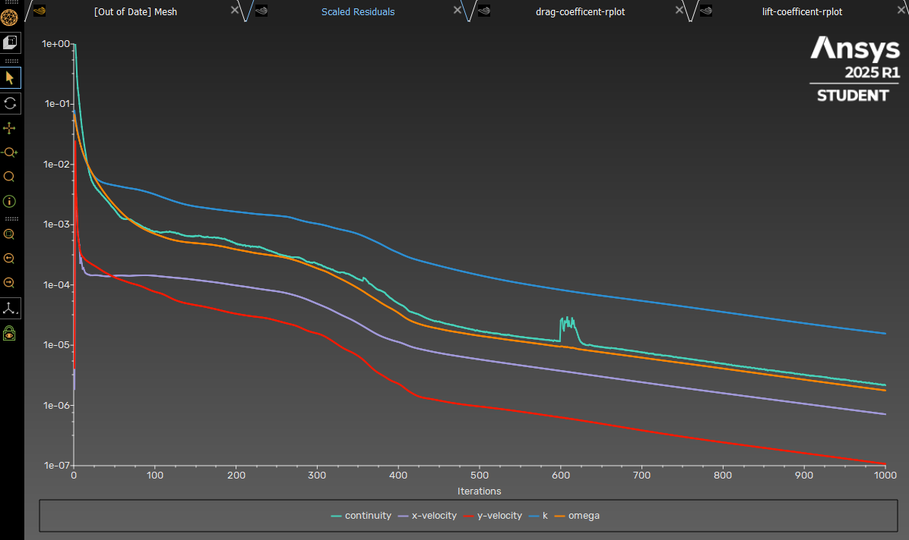
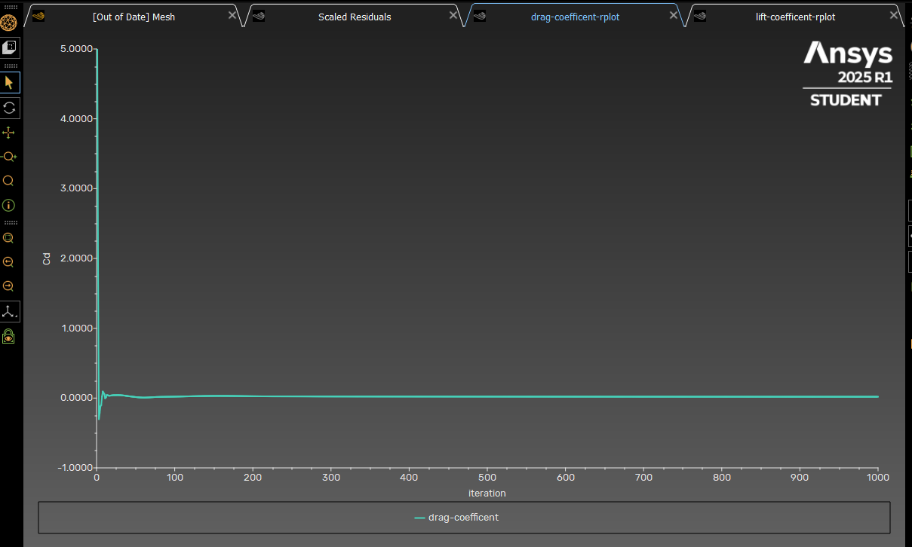
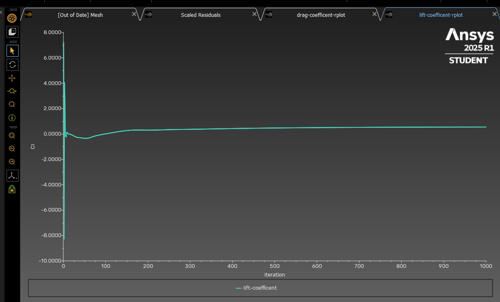

# NACA 2412 Airfoil Stall Analysis: CFD and MATLAB

**2D RANS study of a NACA 2412 airfoil from 0° to 20° angle of attack in ANSYS Fluent (k-ω SST, steady and transient), compared with thin-airfoil theory in MATLAB.**


---

## Objective

Compute lift and drag coefficients of a NACA 2412 over a range of angles of attack. Use them to locate stall, then compare the CFD results with thin-airfoil theory.

## Simulation Setup

| Item | Setting |
|---|---|
| **Airfoil / domain** | NACA 2412, 2D |
| **Mesh** | ≈ 120k cells, quad-dominant |
| **Solver** | Pressure-based. Steady for all AoA, transient at 18° |
| **Turbulence model** | k-ω SST |
| **Inlet** | Velocity inlet, 60 m/s, direction set by AoA |
| **Reynolds number** | ≈ 8 × 10⁵ (chord-based) |
| **Reference values** | Chord 0.2 m, area 0.2 m² (1 m depth), ρ = 1.225 kg/m³ |
| **Steady cases** | 0°, 5°, 10°, 12°, 15°, 18°, 20° |
| **Transient case** | 18°, Δt = 0.001 s, 1000 time steps |


---

## Results

| AoA (°) | $C_l$ (CFD) | $C_d$ (CFD) | $C_l = 2\pi\alpha$ (MATLAB) |
|---:|---:|---:|---:|
| 0 | 0.37 | 0.022 | 0.00 |
| 5 | 0.45 | 0.019 | 0.55 |
| 10 | 0.53 | 0.020 | 1.10 |
| 12 | 0.54 | 0.020 | 1.32 |
| 15 | 0.55 | 0.019 | 1.64 |
| 18 | 0.54 | 0.018 | 1.97 |
| 20 | 0.54 | 0.018 | 2.19 |
| 18 (transient) | 0.56 | 0.018 | – |


| Pressure (transient, 18°) | Velocity (transient, 18°) |
|:---:|:---:|
|  |  |

<details>
<summary><b>Residual, lift and drag monitors for each angle of attack</b></summary>

| AoA | Residuals | Drag | Lift |
|---|:---:|:---:|:---:|
| 0° |  |  |  |
| 5° |  |  |  |
| 10° |  |  |  |
| 12° |  |  |  |
| 15° |  |  |  |
| 18° |  |  |  |
| 18° (transient) |  |  |  |
| 20° |  |  |  |

</details>

---

## Theoretical Comparison ([`theoretical_cl_cd.m`](./theoretical_cl_cd.m))

The MATLAB script uses thin-airfoil theory, $C_l = 2\pi\alpha$, and a parabolic drag polar, $C_d = C_{d0} + k\,C_l^2$ with $C_{d0} = 0.01$ and $k = 0.02$. The theory holds only before stall and does not include the effect of camber.

## Validation Status and Lessons Learned

The CFD lift curve is much flatter than expected. Between 5° and 20°, $C_l$ stays around 0.45–0.55 and $C_d$ does not rise after stall. Published data and cambered thin-airfoil theory, $C_l = 2\pi(\alpha - \alpha_{L0})$ with $\alpha_{L0} \approx -2°$, give $C_l \approx 1.3$ at 10°. The current results therefore **do not yet capture stall correctly**. The likely causes being worked on are:

- **Force-vector definition:** the lift and drag direction vectors must be rotated together with the inlet flow direction for each AoA.
- **Near-wall resolution:** y⁺ > 1, which is too coarse for SST to resolve separation. A finer inflation layer is needed.
- **Convergence and unsteadiness:** post-stall flow is unsteady. Transient runs with Δt ≈ 10⁻⁴ s and longer run times are required.
- **Mesh scaling:** an early scaling error inflated the coefficients. It was corrected, which shows how sensitive the results are to set-up checks.

Future work: a mesh with y⁺ ≈ 1, a check against the experimental data of Abbott & von Doenhoff, and adaptive refinement in the wake.

---

## Repository Contents

```text
├── 0deg/ 5deg/ 10deg/ 12deg/ 15deg/ 18deg/ 20deg/   # Residual, lift and drag monitors per AoA
├── 18deg_transient/                                  # Transient monitors at 18°
├── theoretical_cl_cd.m                               # Thin-airfoil theory and drag polar
├── graph.png                                         # Cl and Cd vs. AoA
├── mesh.png                                          # Mesh
└── *_animation.gif, *_gif.gif / .mpeg                # Pressure and velocity animations
```

## Author

**Burak Yörükçü** · [GitHub](https://github.com/CFDBY) · burakyorukcu@outlook.com
