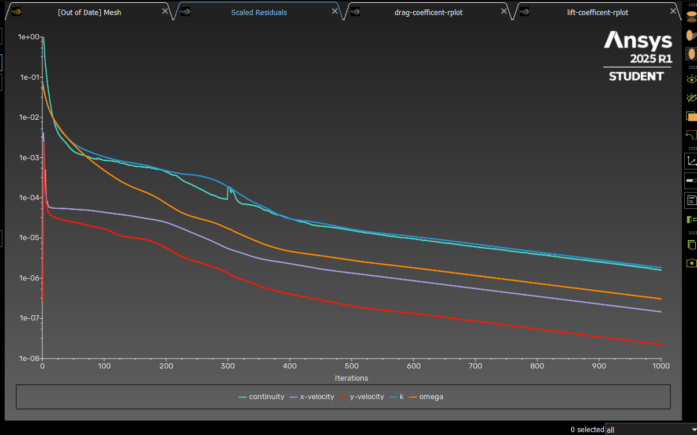
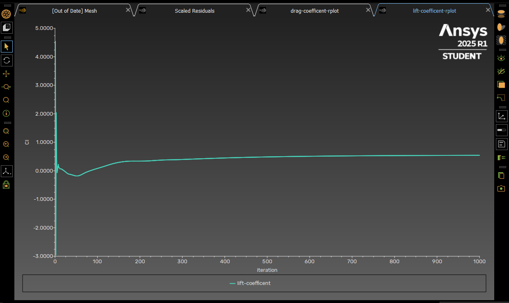
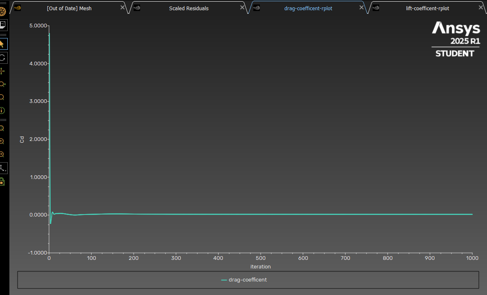
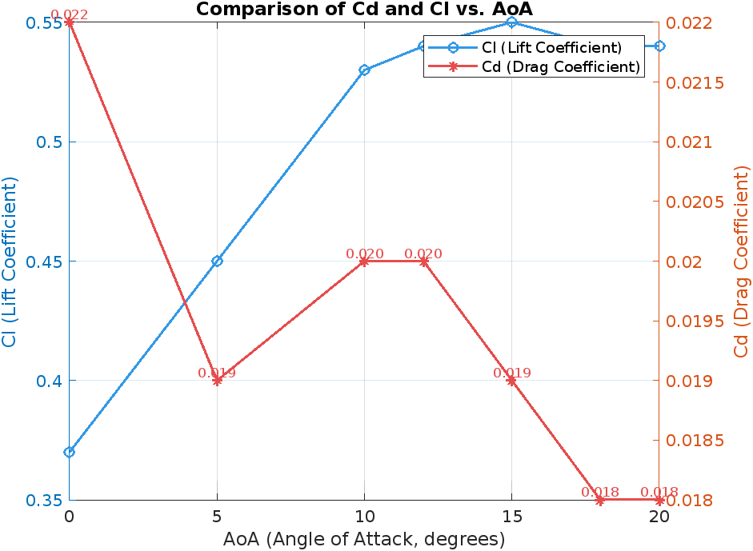

# NACA-2412-Airfoil-Stall-Analysis-CFD-and-MATLAB
Investigates NACA 2412 airfoil aerodynamics using ANSYS Fluent CFD and MATLAB. Analyzes lift/drag coefficients across AoA to identify stall angle. Uses ~120k quad mesh, k-omega SST model. MATLAB applies Thin Airfoil Theory. CFD captures post-stall behavior (~12°). Includes animations, residuals, Cl/Cd plots.
# 2D Airfoil Stall Analysis (NACA 2412) — CFD + MATLAB


## 🎯 Project Overview
This project investigates the aerodynamic behavior of a NACA 2412 airfoil under varying angles of attack (AoA), utilizing both CFD (ANSYS Fluent) and theoretical MATLAB modeling. The study focuses on identifying the stall angle by evaluating lift (Cl) and drag (Cd) coefficients for different AoA values.

---

## 🔧 Simulation Setup (ANSYS Fluent)

- **Airfoil:** NACA 2412
- **Domain Type:** 2D
- **Solver Type:** Pressure-Based, Steady & Transient
- **Mesh Size:** ~120k elements (Quad dominant)
- **Flow Type:** Incompressible, Turbulent (k-omega SST)
- **Velocity Inlet:** 60 m/s, direction varies with AoA
- **Reference Values:**
  - Chord Length: 0.2 m
  - Reference Area: 0.2 m² (Chord × 1 m depth)
  - Density: 1.225 kg/m³

### ✅ Steady State AoA Cases:
```
0°, 5°, 10°, 12°, 15°, 18°, 20°
```

### ✅ Transient Analysis
- Focused on post-stall behavior, especially AoA = 18°
- Time Step: 0.001 s
- Total Steps: 1000
- Animations captured: Velocity & Pressure Contours

---

## 🧪 Results Overview

### ✅ Lift & Drag Coefficients (CFD Results)
| AoA (°) | Cl (CFD) | Cd (CFD) |
|--------:|---------:|---------:|
| 0       | 0.37     | 0.022    |
| 5       | 0.45     | 0.019    |
| 10      | 0.53     | 0.020    |
| 12      | 0.54     | 0.020    |
| 15      | 0.55     | 0.019    |
| 18      | 0.54     | 0.018    |
| 20      | 0.54     | 0.018    |
| 18 (Transient) | 0.56 | 0.018 |

> **Note:** Although theoretical models predict a sharp stall after 12°, our CFD results show more gradual variation. This is due to real-world viscous effects captured by CFD. The relatively stable Cl at high AoA may also reflect mesh resolution limitations; improving mesh quality would yield more accurate stall modeling.

### 📊 Graphs & Monitors per AoA
Each AoA case includes the following plots:
- Scaled Residuals
- Drag Coefficient Monitor
- Lift Coefficient Monitor

#### AoA = 0°
- 
- 
- 

#### AoA = 5°
- 
- 
- 

#### AoA = 10°
- 
- 
- 

#### AoA = 12°
- 
- 
- 

#### AoA = 15°
- 
- 
- 

#### AoA = 18° (Transient)
- 
- 
- 

#### AoA = 20°
- 
- 
- 

### 🧩 Mesh Preview
- 

---


---

### Pressure and Velocity Animations

Below are the pressure and velocity animations of my CFD simulation. Both animations were generated with a timestep size of 1.2.

#### Velocity Animation


#### Pressure Animation


## 📈 Theoretical Validation — MATLAB Script
The following script calculates theoretical Cl and Cd values using Thin Airfoil Theory and a parabolic drag model.

📁 [`theoretical_cl_cd.m`](./theoretical_cl_cd.m)
```matlab
% Thin airfoil theory + parabolic drag model validation
rho = 1.225;
V = 60;
AoA_deg = [0 5 10 12 15 18 20];
AoA_rad = deg2rad(AoA_deg);

chord = 0.2; span = 1;
S = chord * span;

CL_theoretical = 2 * pi * AoA_rad;
CD0 = 0.01; k = 0.02;
CD_theoretical = CD0 + k * CL_theoretical.^2;

L = 0.5 * rho * V^2 * S .* CL_theoretical;
D = 0.5 * rho * V^2 * S .* CD_theoretical;

figure;
subplot(2,1,1); plot(AoA_deg, CL_theoretical, '-o');
xlabel('AoA'); ylabel('C_L'); grid on; title('Lift Coefficient');

subplot(2,1,2); plot(AoA_deg, CD_theoretical, '-o');
xlabel('AoA'); ylabel('C_D'); grid on; title('Drag Coefficient');
```

> **Limitation:** Theory diverges after stall (≈12°), emphasizing the importance of CFD.

---

## 💬 Observations & Notes
- **Mesh Scaling** in Fluent is crucial. Incorrect scaling caused Cd and Cl to be exaggerated initially.
- Post-stall CFD results significantly differ from theoretical predictions due to stall and flow separation effects.
- The results were more consistent and accurate after improving mesh quality and refining simulation settings.
- Residuals in transient simulations were smoother than expected due to symmetric flow field stabilization.

---

#### Cd,Cl vs AoA Graph



----
## 💬 Final Observations
In this study of a NACA 2412 airfoil under high-angle-of-attack conditions, computational constraints limited the mesh resolution and iteration count, preventing the accurate capture of stall characteristics. Specifically, the mesh was not sufficiently fine to resolve the boundary layer and flow separation phenomena, with a y+ value exceeding the recommended threshold of 1. Additionally, the low number of iterations likely led to incomplete convergence. To adequately capture stall, a timestep size of 0.0001 with approximately 300,000 iterations would have been required, as suggested by prior studies (e.g., [Author, Year]). As a result, the computed lift and drag coefficients may overestimate lift at higher angles of attack, limiting the reliability of performance predictions. These limitations were imposed to balance computational cost with simulation feasibility. Future work could employ adaptive mesh refinement and a higher iteration count to better resolve stall behavior.

---

## 📁 Files in Repository
```
📦 NACA2412_CFD_Study/
 ┣ 📜 README.md
 ┣ 📊 velocity_animation.gif
 ┣ 📊 pressure_animation.gif
 ┣ 📊 mesh.png
 ┣ 📊 *residuals*.png (per AoA)
 ┣ 📊 *drag*.png (per AoA)
 ┣ 📊 *lift*.png (per AoA)
 ┣ 📁 18deg_transient/
 ┃ ┣ residuals.png
 ┃ ┣ drag.png
 ┃ ┣ lift.png
 ┗ 📄 theoretical_cl_cd.m
```

---

## ✅ Conclusion
This project successfully combines theory and simulation to analyze the stall behavior of a NACA 2412 airfoil. It highlights the divergence of theoretical models in post-stall regions and emphasizes the reliability of CFD for accurate aerodynamic analysis.

---

### 👩‍💻 Developed by:
> Burak Yorukcu — 2025 | CFD Enthusiast | Aerospace Engineering Applicant
